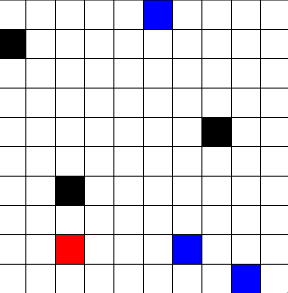
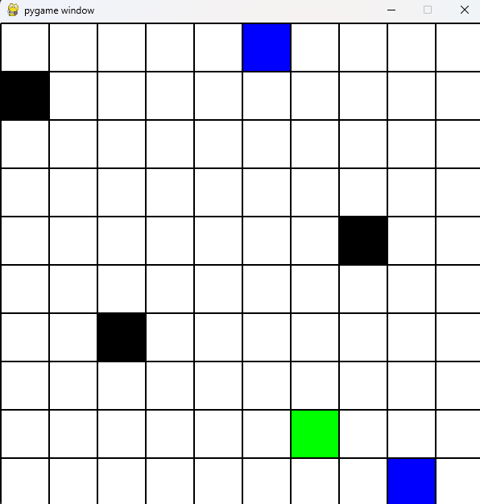

This is a project for my Artificial Intelligence class where a robot finds the nearest checkpoint while avoiding obstacles:

The first image shows the starting point of the Robot with the available checkpoints in blue and the obstacles it needs to avoid in black:

This image shows the result once the robot has calculated and reached the nearest checkpoint and avoided the obstacles:

